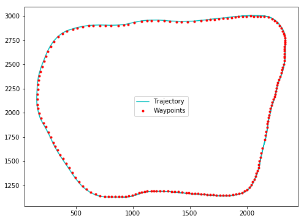

# CarND-Path-Planning-Project
**Self-Driving Car Engineer Nanodegree Program**

   
## Goals
The goal in this project was to safely navigate a car around a virtual highway while keeping its speed below 50MPH. Other cars on the highway move at between 40MPH and 60MPH. Our car, the ego vehicle has to avoid collisions, drive within a lane, and change lanes when needed. The car cannot accelerate at more than 10m/s^2, nor can the rate of acceleration, also known as jerk exceed 10m/s^3. 

---

## Simulator.
The simulator used in this project can be downloaded [here](https://github.com/udacity/self-driving-car-sim/releases). The simulator binds to port 4567 and a controller program can listen to the same port for receiving data from the simulator or sending data to it. The data sent by the simulator includes:

### Ego Vehicle Data
Ego vehicle's localization information.

* ["x"] The car's x position in map coordinates.

* ["y"] The car's y position in map coordinates.

* ["s"] The car's s position in frenet coordinates.

* ["d"] The car's d position in frenet coordinates.

* ["yaw"] The car's yaw angle in the map.

* ["speed"] The car's speed in MPH.


### Previous path data given to the Planner
A  list of untraversed x,y points from those previously given to the simulator. 

* ["previous_path_x"] 

* ["previous_path_y"] 

### Sensor Fusion Data
A vector of vectors, each containing the following data for some car driving on the same side of the road as the ego vehicle.

* [id] Car's unique id.
* [x]  Car's x position in the map.
* [y]  Car's y position in the map.
* [v_x] Car's velocity in x direction on the map.
* [v_y] Car's velocity in y direction on the map.
* [s] Car's S Frenet coordinate.
* [d] Car's D Frenet coordinate.

The car uses a perfect controller and will visit every (x,y) point it receives in the list every .02 seconds. The units for the (x,y) points are in meters and the spacing of the points determines the speed of the car.
 
---

## Map of The Highway 
The map is in data/highway_map.txt. Each waypoint in the list contains  [x,y,s,dx,dy] values. x and y are the waypoint's map coordinate position, the s value is the distance along the road to get to that waypoint in meters, the dx and dy values define the unit normal vector pointing outward of the highway loop.

The highway's waypoints loop around so the frenet s value, distance along the road, goes from 0 to 6945.554.


---

## The Controller

The job of the controller is to use the data coming from the simulator and generate a trajectory that obeys the constraints defined in the goals section. The controller is implemented in [`controller.hpp`](https://github.com/farhanhubble/CarND-Path-Planning/blob/e5c1adfa6bef380f59ee3268a74f9cb0080b64a0/src/controller.hpp) and its method [`generate_trajectory()`](https://github.com/farhanhubble/CarND-Path-Planning/blob/e5c1adfa6bef380f59ee3268a74f9cb0080b64a0/src/controller.hpp#L180) generates the (x,y)
coordinates that are sent to the simulator. The path generation logic is summarized below:

### Path Generation
- Two reference points are identified that are then used to generate new points. These are either the farthest points in the list of untraversed points or, if fewer than two untraversed points are left, the car's current position, and a point slightly behind the position, calculated by extrapolating from the current position and yaw.

- A set of anchor points are generated in the Frenet coordinates. The points are spaced sufficiently far apart in their Frenet s values. The parameter `ANCHOR_S_INCR` defined in `params.hpp` controls the spacing. The spacing is further increased by 1.5X when generating lane-change trajectories.

- The Frenet d coordinate of the anchor points is the center of the 'target' lane. If the car is moving in its lane the target lane is the same the current lane. However if the car is carrying out a lane change maneuver, the target lane is the new lane. The anchor point coordinates are then converted to cartesian coordiantes on the map.   

-  The anchor points' coordinates are converted to the car's frame to avoid dealing with vertical trajectories. 

- A spline is fit to the anchor points.

- (x,y) values are generated along the spline and spaced such that the motion from any point to the next does not cause speed constraints to be violated.

- The (x,y) values generated above are converted back to the map's coordinates.

### Driving Behavior
- The controller sets the acceleration and in turn controls the car's speed based on the car's state and the state of the world and the action the car needs to perform. The car's state is defined by its position, speed and yaw. The state of the world is the state of the other cars, that sensor fusion provides.

- At any time the car performs one of the actions: HALT, KEEP_LANE, CHANGE_LANE_LEFT and CHANGE_LANE_RIGHT. This logic is defined in the `set_target_params()` method in the `controller` class. The car start in KEEP_LANE state.  

- If there is no other vehicle in the car's lane or the vehicle ahead is farther than the value `params::SAFE_FOLLOW_DISTANCE`, the car applies maximum throttle and maintains the lane.

- If there is a vehicle ahead at less than `params::SAFE_FOLLOW_DISTANCE`, but the distance is greater than `params::MIN_SAFE_DISTANCE` the car throttles or brakes appropriately to match the other vehicle's speed and keep following it.

- If the vehicle ahead is at less than `params::MIN_SAFE_DISTANCE` and it is driving slower than the ego vehicle, the car applies brakes, otherwise it applies throttle.

- If the car is following another vehicle, and so driving at the other vehicle's speed, it scans for nearby clear lanes. This is done via a call to  `get_new_lane()`. 

- In the case above, if a lane has no vehicle within collision zones either ahead or behind the ego vehicle, the action state is switched to `CHANGE_LANE_[LEFT|RIGHT]`. 

- During a lane change maneuver, the controller does not change the speed or acceleration until the car switches to its new lane.


### Gotchas
- Trying to generate a trajectory using by fine-stepping over 's' and 'd' coordinates does not work because, sometimes, the x,y values change abruptly even for small changes in 's' and 'd' values.  

- To debug this problem, waypoints were plotted over the generated trajectory. The trajectory appeared smooth but the simulator kept reporting constraint violations.



- By plotting the distance, velocity and acceleration, it became clear that there was a sudden change in acceleration at certain points which was later found to be caused by Frenet to Cartesian conversion.

 


## Results
The car was able to complete multiple laps without any violations. A sample video can be watched on [Youtube](https://www.youtube.com/watch?v=s2eiEcDKFeE). There is a small glitch where the car frequently changes lanes. This can be fixed with a cost function that penalizes this behavior.

## Future Improvements
- The path planning can be made much more robust by building an elaborate state machine. 

- Collision avoidance during lane change maneuvers can be based on solving predicted trajectories of nearby vehicles.

- Multiple candidate trajectories can be generated and ranked based upon their comfort and safety criteria, and the best one used then.

- Since the state machine is relatively small, a reinforcement learning based approach, e.g. [DeepTraffic](https://selfdrivingcars.mit.edu/deeptraffic/) seems feasible for trajectory generation.


---
## Basic Build Instructions

1. Clone this repo.
2. Make a build directory: `mkdir build && cd build`
3. Compile: `cmake .. && make`
4. Run it: `./path_planning`.


---

## Dependencies

* cmake >= 3.5
  * All OSes: [click here for installation instructions](https://cmake.org/install/)
* make >= 4.1
  * Linux: make is installed by default on most Linux distros
  * Mac: [install Xcode command line tools to get make](https://developer.apple.com/xcode/features/)
  * Windows: [Click here for installation instructions](http://gnuwin32.sourceforge.net/packages/make.htm)
* gcc/g++ >= 5.4
  * Linux: gcc / g++ is installed by default on most Linux distros
  * Mac: same deal as make - [install Xcode command line tools]((https://developer.apple.com/xcode/features/)
  * Windows: recommend using [MinGW](http://www.mingw.org/)
* [uWebSockets](https://github.com/uWebSockets/uWebSockets)
  * Run either `install-mac.sh` or `install-ubuntu.sh`.
  * If you install from source, checkout to commit `e94b6e1`, i.e.
    ```
    git clone https://github.com/uWebSockets/uWebSockets 
    cd uWebSockets
    git checkout e94b6e1
    ```

